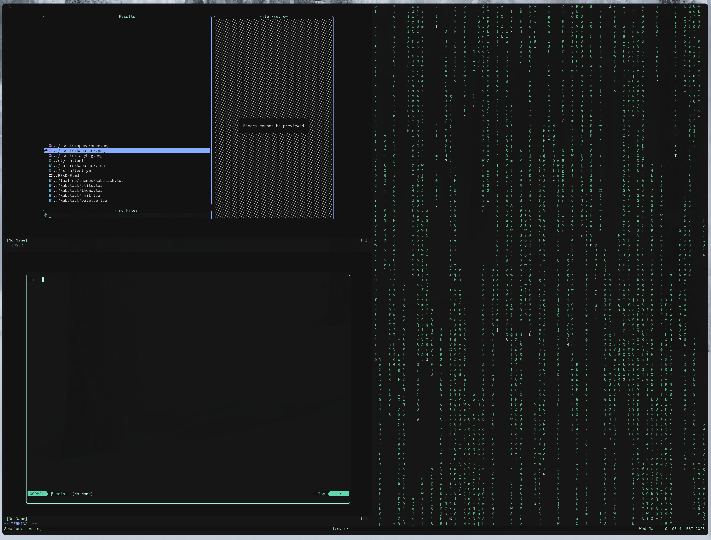

<h3 align="center"></h3>
<h1 align="center">kabutack.nvim</h1>

**> neovim colorscheme** <br>
**> written in lua** <br>
**> new to lua and still exploring** <br>
<h3 align="center"></h3>

*inspired by [poimandres.nvim](https://github.com/olivercederborg/poimandres.nvim)*

## &#x25c8; Installation
install with *[packer]():*
```lua
use { 'mikiya09/kabutack.nvim '}
```
##  &#x270e; Setup
```lua
-- lua 
vim.cmd('colorscheme kabutack')
```
## &#x261e; Configuration
```
working on it...
```
## Extras
```
same theme for apps I like coming soon

1) alacritty 
2) tmux
...
```

<h4 align="center">named after this guy &#x2193;</h4>
<h3 align="center"></h3>

*Notes:
This is a Japanese cartoon series character [kabutack](https://metalheroes.fandom.com/wiki/Kabutack). 
Actually there are more green color options and decorations in the theme instead of red ones, 
so maybe it's more suitable to named after [Kuwagiro](https://metalheroes.fandom.com/wiki/Kuwagiro),
but they both are beetle-like robots, and I prefer kabutack.*

